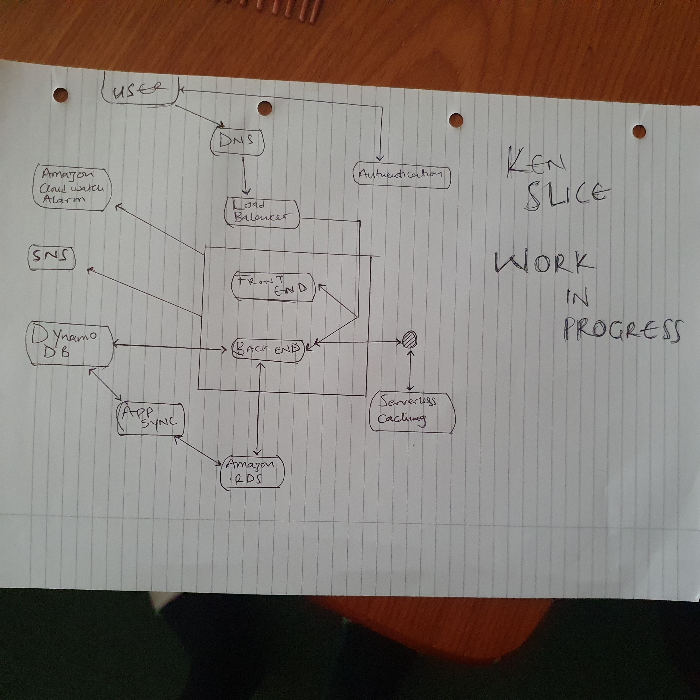

# Week 0 — Billing and Architecture

## For week 0:

### I'm still gettig used to the AWS platform, it has been an insightful journey so far and i'm getting used to the ropes.

### so far:

### I was able to watch all the videos uploaded by the AWS bootcamp team.

### I was able to recreate a conceptual diagram on a Napkin, its still a work in progress.

### I was able to recreate a logical architectural diagram using lucid charts.

[Lucid chart Link](https://lucid.app/lucidchart/8b05e9bb-6993-494f-be7f-e6650ef56c05/edit?viewport_loc=-3344%2C-1218%2C3653%2C1776%2C0_0&invitationId=inv_fb9efe56-03ef-4f2f-af31-77c09305fc8e)

### I was able to use the uploaded video to create an admin user group.

### I was able to use the uploaded video to use cloudshell on my AWS account.

### I was able to generate credentials for my root and user account, also adding MFA to them and export these credentials to my local machine for storage, i also updated the access permissions for AWS Billing, Cost Management, and Account consoles using the instructions provided by AWS.

### I was able to use gitpod to install the AWS CLI as directed in the uploaded videos.

### I was able to create a billing alarm in with the CloudWatch service using the uploaded videos.

### I was able to create an AWS Zero spend budget using the billing service in my AWS Account.

### I was able to open a support ticket and request a service limit increase in the service quotas service.

### I was able to create a topic in the SNS service, and confirm the email for notifications subscription.

### i was able to review the AWS well architected framework.

